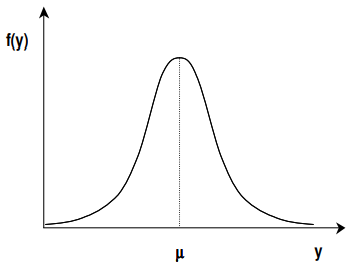
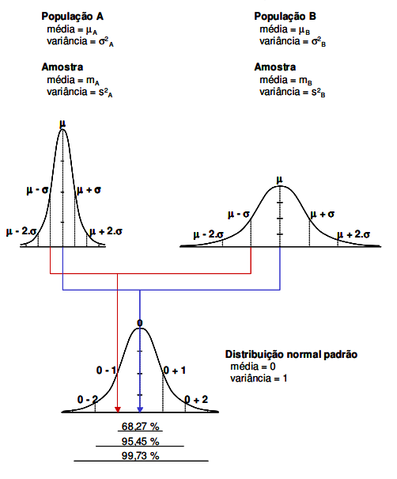

## ESTÁTISTICA

## VARIÁVEIS ALEATÓRIAS
Uma varíavel aleatória é toda e qualquer variável associada a uma probabilidade, isto é, seus valores estão associados a um experimento aleatório.

O uso das variáveis aleatórias equivale a descrever os resultados de um experimento aleatório por meio de números, ao invés de eventos, o que possibilita o tratamento matemático adequado.

### 1. VAD (Variável Aleatória Discreta)
Uma variável aleatória Y será discreta se o número de valores de Y (seu contradomínio), finito ou infinito for numerável. Ou seja, entre quaisquer de dois elementos vizinhos não há quantidades itermediárias.

Isto implica apenas em números inteiros.

#### 1.1 Função de Probabilidades
Chama-se função de probabilidade da VAD Y, a função que cada valor de um elemento da amostra associa sua probabilidade de ocorrência.

A distribuição de probabilidades para uma variável aleatória descreve como as probabilidades estão distribuídas sobre os valores da variável aleatória.

A principal vantagem de definir uma VA e sua distribuição de probabilidades é que, uma vez que a distribuição de probabilidade seja conhecida, é relativamente fácil determinar a probabilidade de eventos que podem ser de interesse de um tomador de decisões.

#### 1.2 Função de Distribuição Acumulada
Seja Y uma VAD, define-se função de distribuição acumulada da VAD Y, no ponto y, como sendo a probabilidade de que Y assuma um valor menor ou igual a y.

#### 1.3 DISTRIBUIÇÃO DE BERNOULLI
Dado eventos dicotômicos (adminitem apenas uma resposta verdadeiras, de duas), neste caso, associa-se p, a probabilidade de sucesso e (1-p), será a probabilidade de fracasso.

Uma VAD (X) de Bernoulli é aquela que assume apenas dois valores com probabilidade de sucesso p, ou seja:
- X = 1, se ocorrer sucesso, implica que P(1) = p ou;
- X = 0, se ocorrer fracasso, implica que P(0) = (1 - p).

Se X ~ Bernoulli(p) mostra-se que: E(X) = p e Var(X) = p(1 - p).

#### 1.4 DISTRIBUIÇÃO BINOMIAL
Experimento aleatório onde as repetidas tentativas também resultam em apenas dois resultados. O diferencial é que na distribuição binomial a variável aleatória indica a probabilidade de x sucessos em n tentativas.

A VAD denota o número de sucessos dado um experimento aleatório binomial.

#### 1.5 DISTRIBUIÇÃO DE POISSON
Expressa a probabilidade de uma série de eventos ocorrer num certo período de tempo ou região espacial.

Na distribuição de Poisson, leva-se em consideração apenas os sucessos num determinado intervalo. Além disso, ela trabalha com a contagem de sucessos num intervalo subdividido em subintervalos.

As propriedades do processo de Poisson são:
- A probabilidade de mais de uma contagem num subintervalo é zero;
- A contagem em cada subintervalo independe de outros intervalos;
- A probabilidade de uma contagem (probabilidade de um sucesso) em um subintervalo é o mesmo para todos os subintervalos e é proporcional ao comprimento do intervalo.

### 2. VAC (Variável Aleatória Contínua)
Uma variável aleatória Y será contínua se o número de valores de Y (seu contradomínio), finito ou infinito for numerável. Ou seja, entre quaisquer de dois elementos vizinhos há quantidades intermediárias infinitas, dependetes da sensibilidade do instrumento de medida.

Isto implica em valores fracionários.

#### 2.1 Função Densidade de Probabilidade
Seja Y uma VAC, a função densidade de probabilidade f(y) define que a probabilidade de qualquer valor especificado de Y, tem P(Y = y) = 0.

Esta função não ira resultar numa probabilidade, a probabilidade so será encontrada quando integrar o valor entre o intervalo a e b, sendo a < b. 

A área total sob a curva de probabilidade vale sempre 1.

### 3. DISTRIBUIÇÃO NORMAL
Também conhecida como distribuição de Gauss, Laplace ou Laplace-Gauss, é a mais importante distribuição de densidade de probabilidade, sendo aplicada em inúmeros fenômenos e utilizada para o desenvolvimento teórico da estatística.

- Alterando o valor da média implica no deslocamento no ponto de máximo ao longo do eixo Y, sem alterações na forma básica;
- Alterações no valor do desvio padrão podem:
  - Aumento: maior dispersão dos dados em torno da média;
  - Redução: menor dispersão dos dados em torno da média.

Para o cálculo das probabilidades utilizando a função de densitdade de probabilidades surge um problema realtivo a integração de f(y), pois seria necessário um desenvolvimento em séries, aleḿ disso teria que tabelar todas as probabilidades considerando-se as várias combinações possísives da média de desvio padrão.

Assim, visando resolver este problema, foi criada uma distribuição normal padronizada ou reduzida (com média zero e desvio padrão igual a um).

Assim, a partir de uma distribuição normal qualquer, pode-se convertê-la para a distribuição normal padrão, obeter as informações necessárias sobre as probabilidades, e retornar a variável original.