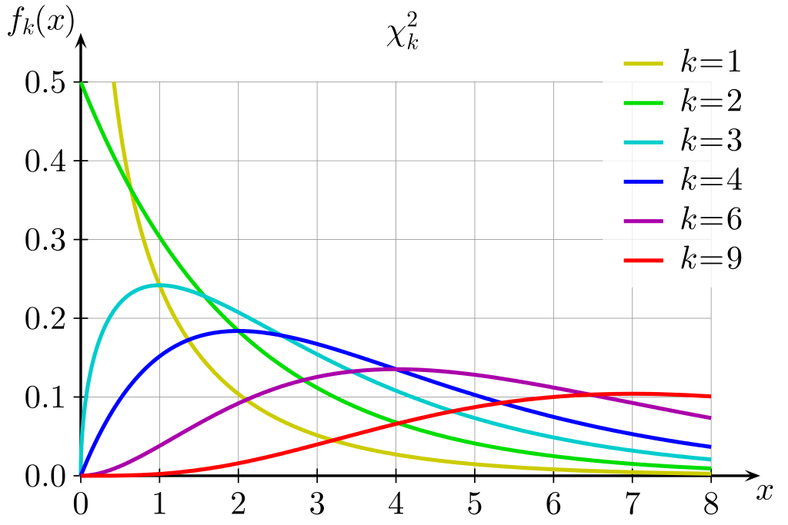

# ESTÁTISTICA

## VARIÁVEIS ALEATÓRIAS

Uma varíavel aleatória é toda e qualquer variável associada a uma probabilidade, isto é, seus valores estão associados a um experimento aleatório.

Uma variável aleatória pode ser entendida como uma variável qualitativa ou quantitativa cujos resultados (valores) dependem de fatores aleatórios.

O uso das variáveis aleatórias equivale a descrever os resultados de um experimento aleatório por meio de números, ao invés de eventos, o que possibilita o tratamento matemático adequado.

### 1. VAD (Variável Aleatória Discreta)

Uma variável aleatória Y será discreta se o número de valores de Y (seu contradomínio), finito ou infinito for numerável. Ou seja, entre quaisquer de dois elementos vizinhos não há quantidades itermediárias.

Isto implica apenas em números inteiros.

#### 1.1 Função de Probabilidades

Chama-se função de probabilidade da VAD Y, a função que cada valor de um elemento da amostra associa sua probabilidade de ocorrência.

A distribuição de probabilidades para uma variável aleatória descreve como as probabilidades estão distribuídas sobre os valores da variável aleatória.

Assim, as funções de uma VAD serão consideradas funções de probabilidade se, e somente se:

- a probabilidade de ocorrência de um elemento seja maior ou igual à zero;
- o somatório de todas as probabilidades de ocorrência seja igual a um.

A principal vantagem de definir uma VA e sua distribuição de probabilidades é que, uma vez que a distribuição de probabilidade seja conhecida, é relativamente fácil determinar a probabilidade de eventos que podem ser de interesse de um tomador de decisões.

#### 1.2 Função de Distribuição Acumulada

Seja Y uma VAD, define-se função de distribuição acumulada da VAD Y, no ponto y, como sendo a probabilidade de que Y assuma um valor menor ou igual a y.

### 2. VAC (Variável Aleatória Contínua)

Uma variável aleatória Y será contínua se o número de valores de Y (seu contradomínio), finito ou infinito for numerável. Ou seja, entre quaisquer de dois elementos vizinhos há quantidades intermediárias infinitas, dependetes da sensibilidade do instrumento de medida.

Isto implica em valores fracionários.

#### 2.1 Função Densidade de Probabilidade

Seja Y uma VAC, a função densidade de probabilidade f(y) define que a probabilidade de qualquer valor especificado de Y, tem P(Y = y) = 0.

Esta função não ira resultar numa probabilidade, a probabilidade so será encontrada quando integrar o valor entre o intervalo a e b, sendo a < b.

A área total sob a curva de probabilidade vale sempre 1.

### 4. DISTRIBUIÇÃO BINOMIAL

Experimento aleatório onde as repetidas tentativas também resultam em apenas dois resultados. O diferencial é que na distribuição binomial a variável aleatória indica a probabilidade de x sucessos em n tentativas.

A VAD denota o número de sucessos dado um experimento aleatório binomial.

No R, a distribuição binomial pode ser utilizada por meio das funções abaixo, tendo como parâmetros o vetor de elementos, o vetor de probabilidades e o número de observações:

```R
dbinom(x, size, prob) # densidade de probabilidade no ponto x
pbinom(x, size, prob) # função de probabilidade acumulada no ponto x
qbinom(p, size, prob) # quantil relativo a uma dada probabilidade p
rbinom(n, size, prob) # amostra da distribuição normal de tamanho n
```

### 3. DISTRIBUIÇÃO DE BERNOULLI

É uma variação da distribuição binomial. Dado eventos dicotômicos (adminitem apenas uma resposta verdadeiras, de duas), neste caso, associa-se p, a probabilidade de sucesso e (1-p), será a probabilidade de fracasso.

Uma VAD (X) de Bernoulli é aquela que assume apenas dois valores com probabilidade de sucesso p, ou seja:

- X = 1, se ocorrer sucesso, implica que P(1) = p ou;
- X = 0, se ocorrer fracasso, implica que P(0) = (1 - p).

Se X ~ Bernoulli(p) mostra-se que: E(X) = p e Var(X) = p(1 - p).

A distribuição de Bernoulli é uma variação da Binomial, sendo considerado apenas um caso, assim o `size=1`.

### 5. DISTRIBUIÇÃO DE POISSON

Expressa a probabilidade de uma série de eventos ocorrer num certo período de tempo ou região espacial.

Na distribuição de Poisson, leva-se em consideração apenas os sucessos num determinado intervalo. Além disso, ela trabalha com a contagem de sucessos num intervalo subdividido em subintervalos.

As propriedades do processo de Poisson são:

- A probabilidade de mais de uma contagem num subintervalo é zero;
- A contagem em cada subintervalo independe de outros intervalos;
- A probabilidade de uma contagem (probabilidade de um sucesso) em um subintervalo é o mesmo para todos os subintervalos e é proporcional ao comprimento do intervalo.

No R, a distribuição binomial pode ser utilizada por meio das funções abaixo:

```R
dpois(x, lambda) # densidade de probabilidade no ponto x
ppois(q, lambda) # função de probabilidade acumulada no ponto x
qpois(p, lambda) # quantil relativo a uma dada probabilidade p
rpois(n, lambda) # amostra da distribuição normal de tamanho n
```

### 6. DISTRIBUIÇÃO NORMAL

Também conhecida como distribuição de Gauss, Laplace ou Laplace-Gauss, é a mais importante distribuição de densidade de probabilidade, sendo aplicada em inúmeros fenômenos e utilizada para o desenvolvimento teórico da estatística.


- Alterando o valor da média implica no deslocamento no ponto de máximo ao longo do eixo Y, sem alterações na forma básica;
- Alterações no valor do desvio padrão podem:
  - Aumento: maior dispersão dos dados em torno da média;
  - Redução: menor dispersão dos dados em torno da média.

Para o cálculo das probabilidades utilizando a função de densitdade de probabilidades surge um problema realtivo a integração de f(y), pois seria necessário um desenvolvimento em séries, aleḿ disso teria que tabelar todas as probabilidades considerando-se as várias combinações possísives da média de desvio padrão.

Assim, visando resolver este problema, foi criada uma distribuição normal padronizada ou reduzida (com média zero e desvio padrão igual a um).


Assim, a partir de uma distribuição normal qualquer, pode-se convertê-la para a distribuição normal padrão, obeter as informações necessárias sobre as probabilidades, e retornar a variável original.

No R, a distribuição normal pode ser utilizada por meio das funções abaixo, em todas elas pode-se definir a média (mean) e o desvio padrão (sd):

```R
dnorm(x, mean, sd) # densidade de probabilidade no ponto x
pnorm(x, mean, sd) # função de probabilidade acumulada no ponto x
qnorm(p, mean, sd) # quantil relativo a uma dada probabilidade p
rnorm(n, mean, sd) # amostra da distribuição normal de tamanho n
```

### 7. DISTRIBUIÇÃO QUI-QUADRADO (X²)

Este teste serve para avaliar quantitativamente a relação entre o resultado de um experimento e a distribuição esperada para o fenômeno.

Caracteristicas:

- Particularidade da Distribuição Gama;
- Assimétrica.

Na distribuição X² existe uma curva para cada tamanho de amostra (n) e todas as curvas têm início em X² = 0.

A probabilidade da distribuição qui-quadrado não é simétrica como a da distribuição normal, para aumentar seu estado de simétria é necessário aumentar o seu grau de liberdade, portanto a relação entre simetria e grau de liberdade são diretamente proporcionais.



No R, a distribuição qui-quadrado pode ser utilizada por meio das funções abaixo, em todas elas pode-se definir o grau de liberdade (df):

```R
dchisq(x, df) # densidade de probabilidade no ponto x
pchisq(x, df) # função de probabilidade acumulada no ponto x
qchisq(p, df) # quantil correspondente a uma dada probabilidade p
rchisq(n, df) # amostra da distribuição X² de tamanho n
```

## 8. DISTRIBUIÇÃO t DE STUDENT

Está distribuição é simétrica e semelhante à curva normal padrão, porém com caudas mais largas, ou seja, uma simulação da t de Student pode gerar valores mais extremos que uma simulação normal. O único parâmetro v que a define e caracteriza a sua forma é o número de graus de liberdade. Quanto maior for o grau de liberdade, mais pŕoxima da normal será.


É utilizada para inferências estatísticas, particularmente, quando se tem amostras com tamanhos inferiores a 30 elementos.

Quando os valores da média e desvio padrão não são conhecidos, e faz-se inferência sobre uma população a partir das estimativas da média e do desvio padrão, ou seja, obtidas nas amostras, utiliza-se a distribuição t. Um exemplo clássico é a estimativa do intervalo de confiança para a média populacional a partir de uma amostra representativa.

No R, a distribuição t pode ser utilizada por meio das funções abaixo, em todas elas pode-se definir o grau de liberdade (df):

```R
dt(x, df) # densidade de probabilidade no ponto x
pt(x, df) # função de probabilidade acumulada no ponto x
qt(p, df) # quantil correspondente a uma dada probabilidade p
rt(n, df) # amostra da distribuição t de tamanho n
```

## 9. DISTRIBUIÇÃO F DE SNEDECOR

É uma distribuição de probabilidade contínua que surge frequentemente como a distribuição nula da estatística de um teste, mais notadamente na análise de variância, como no teste F. Além disso, esta distribuição, dentre as distribuições contínuas de probabilidades, é uma das mais utilizadas para inferências estatísticas em experimentação.


Possuindo dois parâmetros: graus de liberdade do numerador e grau de liberdade no denominador, que são denominados, comumente, por ϕ1 e ϕ2 respectivamente, ela encontra-se tabelada para as probabilidades mais utilizadas nos testes de hipóeses: 1%, 5% e 10%.

No R, a distribuição F pode ser utilizada por meio das funções abaixo, em todas elas pode se definir os graus de liberdade do numerador (df1) e denominador (df2):

```R
df(x, df1, df2) # densidade de probabilidade no ponto x
pf(x, df1, df2) # função de probabilidade acumulada no ponto x
qf(p, df1, df2) # quantil correspondente a uma dada probabilidade p
rf(n, df1, df2) # amostra da distribuição F de tamanho n
```
